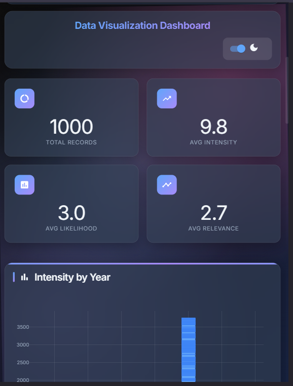

<div align="center">

# 📊 **Data Vizualization Dashboard** ✨

[](https://datavizualization-dashboard.netlify.app/)
[](https://github.com/yourusername/dataviz-pro/stargazers)
[](https://opensource.org/licenses/MIT)
[](http://makeapullrequest.com)


_Transform your data into stunning visual insights with our modern, responsive dashboard featuring glassmorphism design, dark mode, and advanced 3D visualizations._

---

### 🏆 **Key Highlights**

<table>
<tr>
<td align="center">🎨<br><b>Glassmorphism UI</b><br>Modern frosted glass effects</td>
<td align="center">🌙<br><b>Dark/Light Mode</b><br>System-aware theming</td>
<td align="center">📱<br><b>Fully Responsive</b><br>Mobile-first design</td>
<td align="center">⚡<br><b>High Performance</b><br>Optimized rendering</td>
</tr>
<tr>
<td align="center">🔍<br><b>Advanced Filtering</b><br>Multi-criteria search</td>
<td align="center">📈<br><b>3D Visualizations</b><br>Interactive charts</td>
<td align="center">♿<br><b>Accessible</b><br>WCAG 2.1 AA compliant</td>
<td align="center">🚀<br><b>Modern Stack</b><br>React 18  Node.js</td>
</tr>
</table>

</div>

---

## 🛠️ **Tech Stack**

<div align="center">

### **Frontend**


### **Backend**


### **Tools & Deployment**


</div>

---

## 🚀 **Quick Start**

<details>
<summary><b>📋 Prerequisites</b></summary>

Make sure you have the following installed:

- **Node.js** (v14.0.0 or higher)
- **npm** (v6.0.0 or higher) or **yarn**
- **MongoDB** (v4.0.0 or higher)
- **Git**

</details>

### **⚡ Installation**

```bash
# 1️⃣ Clone the repository
git clone https://github.com/Unseencoderz/DataVisualization-server.git
cd DataVisualization-server

# 2️⃣ Install server dependencies
cd server
npm install

# 3️⃣ Install client dependencies
cd ../client
npm install

# 4️⃣ Set up environment variables
cd ../server
cp .env.example .env
# Edit .env with your configuration

# 5️⃣ Start the development servers
# Terminal 1 - Backend
cd server
npm run dev

# Terminal 2 - Frontend
cd client
npm start
```

### **🔧 Environment Setup**

Create a `.env` file in the server directory:

```env
# Server Configuration
PORT=5000
NODE_ENV=development

# Database
MONGODB_URI=mongodb://localhost:27017/dataviz
DB_NAME=dataviz_pro

# Security
JWT_SECRET=your_super_secret_jwt_key
CORS_ORIGIN=http://localhost:3000

# API Configuration
API_VERSION=v1
RATE_LIMIT_WINDOW_MS=900000
RATE_LIMIT_MAX_REQUESTS=100
```

---

## ✨ **Features**

<details>
<summary><b>🎨 UI/UX Enhancements</b></summary>

### **Modern Design System**

- ✅ **Glassmorphism Effects** - Frosted glass aesthetics with backdrop-filter blur
- ✅ **Dark/Light Mode** - System-aware theme switching with smooth transitions
- ✅ **Animated Backgrounds** - Dynamic gradient backgrounds with floating particles
- ✅ **Modern Typography** - Inter font family with improved readability
- ✅ **Responsive Design** - Mobile-first approach with fluid breakpoints

### **Interactive Components**

- ✅ **Statistics Cards** - Real-time metrics with glassmorphism effects
- ✅ **Advanced Filtering** - Multi-criteria search with visual feedback
- ✅ **Data Table** - Sortable, searchable table with pagination
- ✅ **Loading States** - Skeleton screens and smooth transitions
- ✅ **Error Handling** - Graceful error states with retry options

</details>

<details>
<summary><b>📊 Advanced Visualizations</b></summary>

### **Chart Types**

- 📈 **3D Scatter Plots** - Interactive intensity/likelihood/relevance correlation
- 🔥 **Heatmaps** - Sector vs Region intensity mapping
- 🍩 **Enhanced Donut Charts** - Sector distribution with center annotations
- 📊 **Bar Charts** - Responsive intensity visualization by year
- 📉 **Line Charts** - Trend analysis with smooth curves

### **Visualization Features**

- ✅ **Interactive Tooltips** - Rich hover information with formatting
- ✅ **Zoom & Pan** - Navigate through large datasets
- ✅ **Export Options** - Download charts as PNG/SVG/PDF
- ✅ **Real-time Updates** - Live data synchronization
- ✅ **Theme Integration** - Charts adapt to dark/light mode

</details>

<details>
<summary><b>⚡ Performance Optimizations</b></summary>

### **Frontend Performance**

- ⚡ **Component Memoization** - Optimized re-renders with React.memo
- ⚡ **Lazy Loading** - Code splitting for faster initial load
- ⚡ **Efficient State Management** - Consolidated filter state
- ⚡ **Debounced Search** - Optimized search performance
- ⚡ **Virtual Scrolling** - Handle large datasets efficiently

### **Backend Performance**

- ⚡ **Database Indexing** - Optimized MongoDB queries
- ⚡ **Response Caching** - Redis integration for faster responses
- ⚡ **API Rate Limiting** - Prevent abuse and ensure stability
- ⚡ **Compression** - Gzip compression for smaller payloads
- ⚡ **Error Logging** - Comprehensive error tracking

</details>

<details>
<summary><b>♿ Accessibility Features</b></summary>

### **WCAG 2.1 AA Compliance**

- ✅ **Keyboard Navigation** - Full keyboard accessibility
- ✅ **Screen Reader Support** - Semantic HTML and ARIA labels
- ✅ **Color Contrast** - High contrast ratios for readability
- ✅ **Focus Management** - Visible focus indicators
- ✅ **Reduced Motion** - Respects user motion preferences

</details>

---

## 🖼️ **Screenshots**

<details>
<summary><b>📱 Desktop & Mobile Views</b></summary>

### **Desktop Dashboard**


### **Mobile Responsive**

<div align="center">

</div>

### **Dark Mode**


</details>

<details>
<summary><b>📊 Chart Visualizations</b></summary>

### **3D Scatter Plot**


### **Interactive Heatmap**


### **Statistics Cards**


</details>

---

## 🌐 **API Documentation**

<details>
<summary><b>📡 API Endpoints</b></summary>

### **Base URL**

```
https://your-api-domain.com/api/v1
```

### **Data Endpoints**

#### **GET /data**

Retrieve all data entries with optional filtering.

```javascript
// Request
GET /api/v1/data?sector=Energy&region=Asia&limit=100&page=1

// Response
{
  "success": true,
  "data": [
    {
      "_id": "507f1f77bcf86cd799439011",
      "title": "Energy Market Analysis",
      "sector": "Energy",
      "region": "Asia",
      "country": "India",
      "intensity": 4,
      "likelihood": 3,
      "relevance": 5,
      "published": "2024-01-15T10:30:00Z",
      "source": "Reuters",
      "url": "https://example.com/article"
    }
  ],
  "pagination": {
    "currentPage": 1,
    "totalPages": 10,
    "totalItems": 1000,
    "hasNext": true,
    "hasPrev": false
  }
}
```

#### **GET /data/stats**

Get aggregated statistics for dashboard metrics.

```javascript
// Response
{
  "success": true,
  "stats": {
    "totalRecords": 1000,
    "avgIntensity": 3.2,
    "avgLikelihood": 2.8,
    "avgRelevance": 3.5,
    "sectorDistribution": {
      "Energy": 250,
      "Technology": 200,
      "Healthcare": 150
    }
  }
}
```

### **Error Responses**

```javascript
{
  "success": false,
  "error": {
    "code": "VALIDATION_ERROR",
    "message": "Invalid sector parameter",
    "details": {
      "field": "sector",
      "value": "invalid_sector",
      "allowedValues": ["Energy", "Technology", "Healthcare"]
    }
  }
}
```

</details>

<details>
<summary><b>🔐 Authentication</b></summary>

### **API Key Authentication**

Include your API key in the request headers:

```javascript
headers: {
  'Authorization': 'Bearer YOUR_API_KEY',
  'Content-Type': 'application/json'
}
```

### **Rate Limiting**

- **Limit**: 100 requests per 15 minutes per IP
- **Headers**: Rate limit info included in response headers

</details>

---

## 📁 **Project Structure**

<details>
<summary><b>🏗️ Folder Organization</b></summary>

```
📦 /DataVisualization-server
├── 📁 client/                          # Frontend React Application
│   ├── 📁 public/
│   │   ├── 📄 index.html
│   │   ├── 📄 manifest.json
│   │   └── 📁 icons/
│   ├── 📁 src/
│   │   ├── 📁 components/              # Reusable UI Components
│   │   │   ├── 📄 Dashboard.js         # Main dashboard component
│   │   │   ├── 📄 StatsCard.js         # Statistics display cards
│   │   │   ├── 📄 LoadingSpinner.js    # Loading states
│   │   │   ├── 📄 FilterPanel.js       # Advanced filtering
│   │   │   ├── 📄 ChartContainer.js    # Chart wrapper
│   │   │   ├── 📄 DataTable.js         # Data table with features
│   │   │   └── 📄 AdvancedCharts.js    # 3D visualizations
│   │   ├── 📁 styles/                  # CSS Stylesheets
│   │   │   ├── 📄 Dashboard.css        # Main dashboard styles
│   │   │   ├── 📄 globals.css          # Global styles
│   │   │   └── 📄 themes.css           # Theme configurations
│   │   ├── 📁 utils/                   # Utility functions
│   │   │   ├── 📄 api.js               # API client
│   │   │   ├── 📄 helpers.js           # Helper functions
│   │   │   └── 📄 constants.js         # App constants
│   │   ├── 📁 hooks/                   # Custom React hooks
│   │   │   ├── 📄 useTheme.js          # Theme management
│   │   │   ├── 📄 useApi.js            # API calls
│   │   │   └── 📄 useLocalStorage.js   # Local storage
│   │   ├── 📄 App.js                   # Main App component
│   │   ├── 📄 App.css                  # App styles
│   │   └── 📄 index.js                 # Entry point
│   ├── 📄 package.json                 # Dependencies & scripts
│   └── 📄 .env.example                 # Environment variables template
├── 📁 server/                          # Backend Node.js Application
│   ├── 📁 controllers/                 # Route controllers
│   │   ├── 📄 dataController.js        # Data operations
│   │   ├── 📄 statsController.js       # Statistics operations
│   │   └── 📄 authController.js        # Authentication
│   ├── 📁 models/                      # Database models
│   │   ├── 📄 Data.js                  # Data model schema
│   │   └── 📄 User.js                  # User model schema
│   ├── 📁 routes/                      # API routes
│   │   ├── 📄 dataRoutes.js            # Data endpoints
│   │   ├── 📄 statsRoutes.js           # Statistics endpoints
│   │   └── 📄 authRoutes.js            # Auth endpoints
│   ├── 📁 middleware/                  # Custom middleware
│   │   ├── 📄 auth.js                  # Authentication middleware
│   │   ├── 📄 errorHandler.js          # Error handling
│   │   ├── 📄 logger.js                # Request logging
│   │   └── 📄 rateLimiter.js           # Rate limiting
│   ├── 📁 config/                      # Configuration files
│   │   ├── 📄 database.js              # Database connection
│   │   ├── 📄 cors.js                  # CORS configuration
│   │   └── 📄 environment.js           # Environment setup
│   ├── 📁 utils/                       # Utility functions
│   │   ├── 📄 validation.js            # Input validation
│   │   ├── 📄 helpers.js               # Helper functions
│   │   └── 📄 constants.js             # Server constants
│   ├── 📄 app.js                       # Express app setup
│   ├── 📄 server.js                    # Server entry point
│   ├── 📄 package.json                 # Dependencies & scripts
│   └── 📄 .env.example                 # Environment variables template
├── 📁 docs/                            # Documentation
│   ├── 📄 API.md                       # API documentation
│   ├── 📄 DEPLOYMENT.md                # Deployment guide
│   └── 📄 CONTRIBUTING.md              # Contribution guidelines
├── 📄 README.md                        # This file
├── 📄 FRONTEND_IMPROVEMENTS.md         # Frontend enhancement docs
├── 📄 LICENSE                          # MIT License
├── 📄 .gitignore                       # Git ignore rules
└── 📄 docker-compose.yml               # Docker configuration
```

</details>

---

## 🎯 **Usage Guide**

<details>
<summary><b>🚀 Getting Started</b></summary>

### **1. Dashboard Overview**

After starting the application, you'll see the main dashboard with:

- **Statistics Cards**: Key metrics at the top
- **Filter Panel**: Left sidebar for data filtering
- **Charts Section**: Various visualizations
- **Data Table**: Detailed data view at the bottom

### **2. Using Filters**

1. **Open Filter Panel**: Click on any filter dropdown
2. **Select Criteria**: Choose from available options
3. **Apply Filters**: Data updates automatically
4. **Clear Filters**: Use the clear button to reset

### **3. Interacting with Charts**

- **Hover**: View detailed tooltips
- **Zoom**: Use mouse wheel on 3D charts
- **Pan**: Click and drag to navigate
- **Toggle**: Click legend items to show/hide data

### **4. Theme Switching**

- **Auto Mode**: Follows system preference
- **Manual Toggle**: Use the theme switch in the navbar
- **Persistence**: Theme preference is saved locally

</details>

<details>
<summary><b>📊 Chart Types Guide</b></summary>

### **Bar Chart - Intensity by Year**

Shows intensity values grouped by publication year.

- **Use Case**: Trend analysis over time
- **Interactions**: Hover for exact values
- **Filtering**: Responsive to all filters

### **3D Scatter Plot - Multi-dimensional Analysis**

Displays intensity, likelihood, and relevance correlation.

- **Use Case**: Complex relationship analysis
- **Interactions**: Rotate, zoom, and hover
- **Color Coding**: By relevance values

### **Heatmap - Sector vs Region**

Shows intensity distribution across sectors and regions.

- **Use Case**: Geographic and sector analysis
- **Color Scale**: Darker = higher intensity
- **Interactions**: Hover for exact values

### **Donut Chart - Sector Distribution**

Displays the proportion of records by sector.

- **Use Case**: Distribution analysis
- **Center Annotation**: Total record count
- **Interactions**: Click to filter by sector

</details>

---

## 🤝 **Contributing**

<details>
<summary><b>🛠️ Development Setup</b></summary>

### **Prerequisites for Contributors**

- Node.js (v14)
- MongoDB (v4)
- Git
- Code editor (VS Code recommended)

### **Development Workflow**

```bash
# 1. Fork the repository
# 2. Clone your fork
git clone https://github.com/Unseencoderz/DataVisualization-server.git

# 3. Create a feature branch
git checkout -b feature/amazing-feature

# 4. Install dependencies
npm run install:all

# 5. Start development servers
npm run dev

# 6. Make your changes
# 7. Run tests
npm run test

# 8. Commit your changes
git commit -m "Add amazing feature"

# 9. Push to your fork
git push origin feature/amazing-feature

# 10. Create a Pull Request
```

</details>

<details>
<summary><b>📋 Contribution Guidelines</b></summary>

### **Code Standards**

- ✅ Follow ESLint configuration
- ✅ Use Prettier for formatting
- ✅ Write meaningful commit messages
- ✅ Add JSDoc comments for functions
- ✅ Include unit tests for new features

### **Pull Request Process**

1. **Update Documentation**: Include relevant docs updates
2. **Add Tests**: Ensure new features have test coverage
3. **Check Performance**: No significant performance regression
4. **Update Changelog**: Add entry for your changes
5. **Request Review**: Tag maintainers for review

### **Issue Reporting**

When reporting issues, please include:

- **Environment**: OS, Node.js version, browser
- **Steps to Reproduce**: Detailed reproduction steps
- **Expected Behavior**: What should happen
- **Actual Behavior**: What actually happens
- **Screenshots**: If applicable

</details>

<details>
<summary><b>🏆 Contributors</b></summary>

<div align="center">

### **🌟 Hall of Fame**

### 🌟 **Hall of Fame**

This project is proudly built and maintained solo with 💻❤️ by [@Unseencoderz](https://github.com/Unseencoderz).

<a href="https://github.com/Unseencoderz/DataVisualization-server">
  
</a>

_Made with [contrib.rocks](https://contrib.rocks) — though it’s a solo act, every commit counts!_

</div>

</details>

---

## 📜 **License**

<details>
<summary><b>⚖️ MIT License</b></summary>

```
MIT License

Copyright (c) 2024 DataViz Pro Dashboard

Permission is hereby granted, free of charge, to any person obtaining a copy
of this software and associated documentation files (the "Software"), to deal
in the Software without restriction, including without limitation the rights
to use, copy, modify, merge, publish, distribute, sublicense, and/or sell
copies of the Software, and to permit persons to whom the Software is
furnished to do so, subject to the following conditions:

The above copyright notice and this permission notice shall be included in all
copies or substantial portions of the Software.

THE SOFTWARE IS PROVIDED "AS IS", WITHOUT WARRANTY OF ANY KIND, EXPRESS OR
IMPLIED, INCLUDING BUT NOT LIMITED TO THE WARRANTIES OF MERCHANTABILITY,
FITNESS FOR A PARTICULAR PURPOSE AND NONINFRINGEMENT. IN NO EVENT SHALL THE
AUTHORS OR COPYRIGHT HOLDERS BE LIABLE FOR ANY CLAIM, DAMAGES OR OTHER
LIABILITY, WHETHER IN AN ACTION OF CONTRACT, TORT OR OTHERWISE, ARISING FROM,
OUT OF OR IN CONNECTION WITH THE SOFTWARE OR THE USE OR OTHER DEALINGS IN THE
SOFTWARE.
```

</details>

---

## 📞 **Contact & Support**

<div align="center">

### **🤝 Get in Touch**

<table>
<tr>
<td align="center">
<a href="mailto:gautamsahil.dev@gmail.com">

</a>
</td>
<td align="center">
<a href="https://www.linkedin.com/in/sahil-gautam-996155268/">

</a>
</td>
<td align="center">
<a href="https://twitter.com/yourhandle">

</a>
</td>
<td align="center">
<a href="https://github.com/Unseencoderz">

</a>
</td>
</tr>
</table>

### **💬 Community**

[](https://discord.gg/your-server)
[](https://your-workspace.slack.com)

### **🐛 Bug Reports & Feature Requests**

[](https://github.com/Unseencoderz/DataVisualization-server/issues)
[](https://github.com/Unseencoderz/DataVisualization-server/discussions)

</div>

---

<div align="center">

### **🌟 Show Your Support**

If this project helped you, please consider giving it a ⭐ on GitHub!

[](https://github.com/Unseencoderz/DataVisualization-server/stargazers)
[](https://github.com/Unseencoderz/DataVisualization-server/network/members)
[](https://github.com//Unseencoderz/DataVisualization-server/watchers)

---

<p>
<i>Built with ❤️ by Sahil gautam</i>
</p>

<p>
<sub>© 2024 DataVisualization-server Pro Dashboard. All rights reserved.</sub>
</p>

</div>
